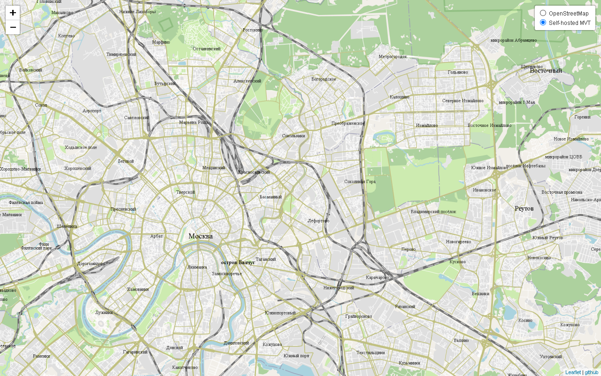
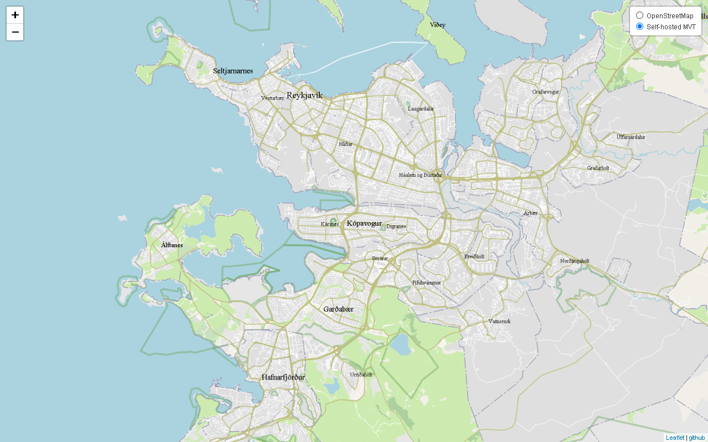
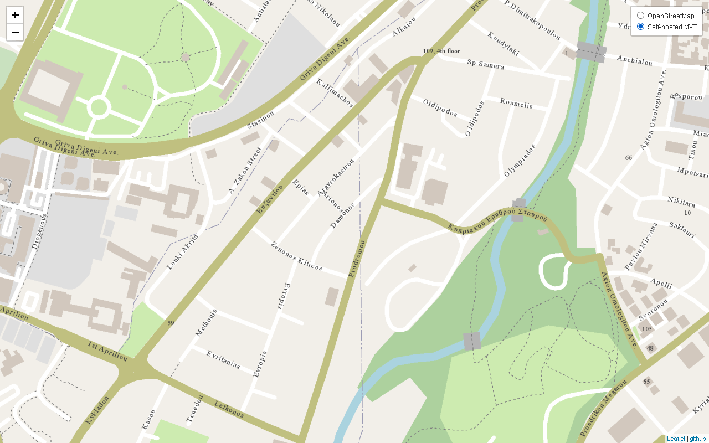

# mbtiles Server (Java 17)
**Java web server for self-hosting the Mapbox Vector Tile database.**

Features
---

The app serves <a target="_blank" rel="noopener noreferrer" href="https://github.com/protocolbuffers/protobuf">**pbf**</a> <a target="_blank" rel="noopener noreferrer" href="https://docs.mapbox.com/help/glossary/vector-tiles/">**vector tiles**</a> at `http://hostName:8080/mvt/{z}/{x}/{y}.png`  
The map shows the most common land cover, buildings, transportation routes, localities, street names and house numbers. POI, etc. not present so far.  

  
  

Performance tested on *.mbtiles taken from 
<a target="_blank" rel="noopener noreferrer" href="https://extract.bbbike.org">bbbike.org</a> and 
<a target="_blank" rel="noopener noreferrer" href="https://data.maptiler.com/downloads/planet/">maptiler.com</a>.  
In addition to vector tiles one can host pre-rendered bitmaps generated with 
<a target="_blank" rel="noopener noreferrer" href="http://maperitive.net/">Maperitive</a>.

How to start the mbtilesServer application
---

1. Run `mvn clean install` to build the application
1. Start application with `java -jar target/mbtilesServ-0.0.1-SNAPSHOT.jar`
1. To check that the application is running enter url <a target="_blank" rel="noopener noreferrer" href="http://localhost:8080">http://localhost:8080</a>

Resources used
---

Application framework: <a target="_blank" rel="noopener noreferrer" href="https://spring.io/">Spring</a>.  
Vector tiles decoder: <a target="_blank" rel="noopener noreferrer" href="https://github.com/ElectronicChartCentre/java-vector-tile">ElectronicChartCentre java-vector-tile</a>.  
Client side Leaflet: <a target="_blank" rel="noopener noreferrer" href="http://leafletjs.com/">leafletjs.com</a>.  
Vector tile schema: <a target="_blank" rel="noopener noreferrer" href="https://openmaptiles.org/schema/">openmaptiles.org</a>.

